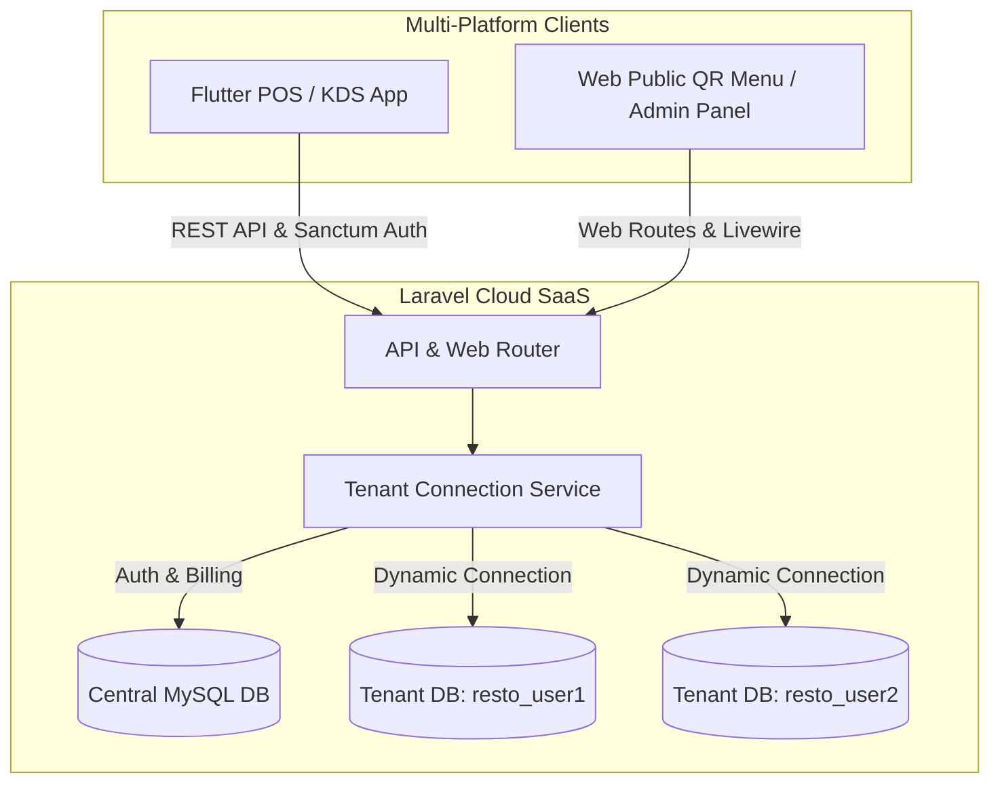

# System Architecture 🚀

**EatsOnly** is built as a highly scalable, multi-tenant Software-as-a-Service (SaaS) ecosystem designed to handle end-to-end restaurant operations, Point of Sale (POS) checkouts, kitchen orchestration (KDS), and dynamic QR-based customer self-ordering.

## Overview

## Technology Stack

*   **Backend SaaS Engine:** Laravel 11, Livewire (Admin Panels, Checkout, & Public Menu), Tailwind CSS, Vite.
*   **Database Isolation Model:** Separate database per tenant (Restaurant Group/Owner).
*   **Mobile / Desktop / Web POS Client:** Flutter (supporting offline-resilient flows, local thermal receipt printing, custom split payment processing).

---
Back to [Wiki Index](README.md)
